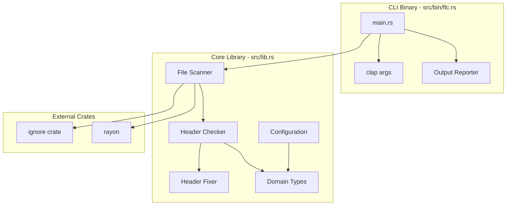
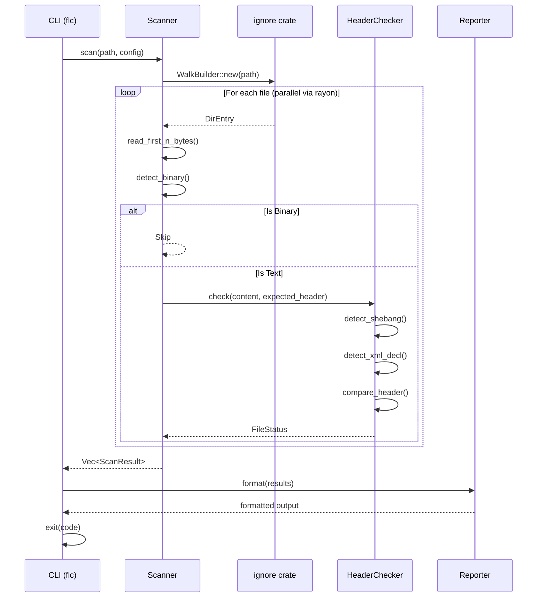
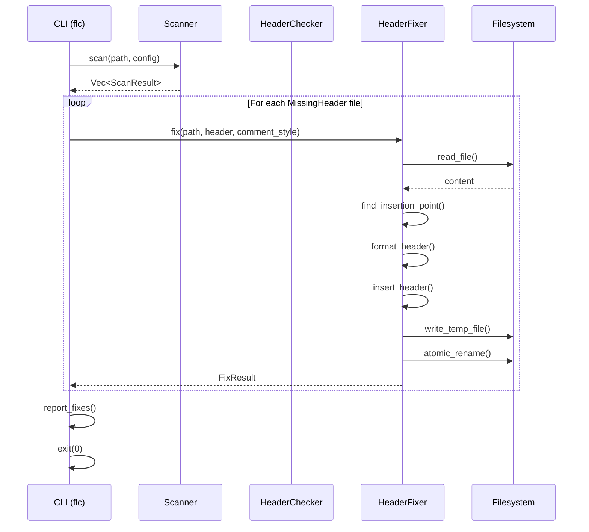

# Fast License Checker - Build Plan

## Executive Summary

This document provides a complete, step-by-step action plan for building a blazing-fast, Rust-based CLI tool and library for checking and fixing license headers in source files. The implementation follows the **Modular Monolith** architecture pattern with strict type safety, comprehensive testing, and CI/CD quality gates.

**Target Performance:** 100,000 files scanned in under 1 second (warm cache)

---

## Table of Contents

1. [Architecture Overview](#architecture-overview)
2. [Project Structure](#project-structure)
3. [Phase 1: Bootstrap](#phase-1-bootstrap-day-1)
4. [Phase 2: RFC and Design](#phase-2-rfc-and-design-day-2)
5. [Phase 3: Core Library Implementation](#phase-3-core-library-implementation-days-3-5)
6. [Phase 4: CLI Implementation](#phase-4-cli-implementation-day-6)
7. [Phase 5: Testing](#phase-5-testing-day-7)
8. [Phase 6: CI/CD Setup](#phase-6-cicd-setup-day-8)
9. [Cursor Workflow Summary](#cursor-workflow-summary)
10. [Key Architecture Decisions](#key-architecture-decisions)
11. [Validation Checkpoints](#validation-checkpoints)

---

## Architecture Overview

This project follows the **Modular Monolith** pattern, adapted for a CLI tool:



### Data Flow - Scan Mode



### Data Flow - Fix Mode



---

## Project Structure

```
fast-license-checker/
├── .cursorrules                    # AI coding guidelines
├── .github/
│   ├── workflows/
│   │   └── ci.yml                  # Quality gate CI
│   └── scripts/
│       └── check_primitives.sh     # Ban raw primitives in core
├── Cargo.toml                      # Package manifest
├── Cargo.lock
├── clippy.toml                     # Strict linting rules
├── deny.toml                       # Supply chain security policy
├── rustfmt.toml                    # Formatting rules
├── README.md
│
├── docs/
│   ├── inputs/                     # Business requirements
│   │   └── fast-license-checker-requirements.txt
│   ├── rfcs/                       # Technical design docs
│   │   ├── 0000-build-plan.md      # This document
│   │   └── 0001-license-checker.md # Feature RFC
│   └── adr/                        # Architecture decisions
│       └── 001-use-ignore-crate.md
│
├── src/
│   ├── lib.rs                      # Library entry point
│   ├── design_sketch.rs            # Type skeleton (temporary)
│   │
│   ├── config/                     # Configuration handling
│   │   ├── mod.rs
│   │   ├── types.rs                # Config structs
│   │   └── loader.rs               # TOML/CLI loading
│   │
│   ├── scanner/                    # File walking & filtering
│   │   ├── mod.rs
│   │   ├── walker.rs               # ignore crate wrapper
│   │   └── filter.rs               # Binary detection
│   │
│   ├── checker/                    # Header detection & validation
│   │   ├── mod.rs
│   │   ├── detector.rs             # Header presence check
│   │   ├── validator.rs            # Similarity matching
│   │   └── prelude.rs              # Shebang/XML detection
│   │
│   ├── fixer/                      # Header insertion logic
│   │   ├── mod.rs
│   │   ├── inserter.rs             # Header formatting
│   │   └── writer.rs               # Atomic file writes
│   │
│   ├── types/                      # Domain NewTypes
│   │   ├── mod.rs
│   │   ├── file_types.rs           # FilePath, FileExtension
│   │   ├── header_types.rs         # LicenseHeader, CommentStyle
│   │   └── results.rs              # FileStatus, ScanResult
│   │
│   └── error.rs                    # Typed errors (thiserror)
│
├── src/bin/
│   └── flc.rs                      # CLI entry point (clap + anyhow)
│
├── tests/
│   ├── common/
│   │   └── mod.rs                  # Test fixtures & helpers
│   └── integration/
│       ├── scan_mode.rs            # Scan mode e2e tests
│       ├── fix_mode.rs             # Fix mode e2e tests
│       └── edge_cases.rs           # Shebang, binary, etc.
│
├── benches/
│   └── scan_performance.rs         # 100k file benchmark
│
└── snapshots/                      # insta test snapshots
    └── *.snap
```

---

## Phase 1: Bootstrap (Day 1)

### Step 1.1: Initialize Project

**Cursor Prompt:**

```
Create a new Rust project for a CLI tool called "fast-license-checker" with the following structure:

1. Cargo.toml with:
   - Package name: fast-license-checker
   - Binary name: flc
   - Edition 2021
   - License: MIT OR Apache-2.0
   - Workspace lints for clippy (deny unwrap_used, expect_used, panic)
   
2. Dependencies:
   - ignore = "0.4" (from ripgrep, for file walking)
   - rayon = "1.10" (parallel processing)
   - clap = { version = "4", features = ["derive", "env"] }
   - thiserror = "2"
   - anyhow = "1"
   - tracing = "0.1"
   - tracing-subscriber = { version = "0.3", features = ["fmt", "env-filter"] }
   - serde = { version = "1", features = ["derive"] }
   - toml = "0.8" (for config files)
   - memchr = "2" (fast byte searching)
   
3. Dev dependencies:
   - tempfile = "3" (for test fixtures)
   - criterion = { version = "0.5", features = ["html_reports"] }
   - proptest = "1"
   - insta = { version = "1", features = ["json"] }

4. Create empty src/lib.rs and src/bin/flc.rs with minimal structure

5. Add [[bench]] section for criterion:
   [[bench]]
   name = "scan_performance"
   harness = false
```

**Expected Output:** Valid Cargo.toml, empty lib.rs and bin/flc.rs that compile

---

### Step 1.2: Configuration Files

**Cursor Prompt:**

```
Create the following configuration files for the fast-license-checker project:

1. clippy.toml with strict rules enforcing reliability:
   
   [lints.clippy]
   # Tenet 6: Reliability - Ban crashes
   unwrap_used = "deny"
   expect_used = "deny"
   panic = "deny"
   indexing_slicing = "deny"
   
   # Tenet 2: Correctness - Prevent silent bugs
   arithmetic_side_effects = "warn"
   
   # Tenet 7: Simplicity - Clean code
   wildcard_imports = "deny"
   enum_glob_use = "deny"

2. deny.toml for supply chain security:
   
   [advisories]
   vulnerability = "deny"
   unmaintained = "warn"
   
   [licenses]
   unlicensed = "deny"
   allow = ["MIT", "Apache-2.0", "BSD-2-Clause", "BSD-3-Clause", "ISC", "MPL-2.0", "Unicode-DFS-2016"]
   copyleft = "deny"
   
   [bans]
   multiple-versions = "warn"

3. rustfmt.toml with consistent formatting:
   
   max_width = 100
   use_small_heuristics = "Max"
   edition = "2021"
   newline_style = "Unix"
   use_field_init_shorthand = true
   use_try_shorthand = true
```

**Validation:** Run `cargo fmt --check`, `cargo clippy`, `cargo deny check`

---

### Step 1.3: Create .cursorrules

**Cursor Prompt:**

```
Create .cursorrules file for fast-license-checker project encoding these principles:

# Project: Fast License Checker - Blazing Fast License Header Verification
# Role: You are a senior Rust engineer building a high-performance CLI tool

## Core Principles (7 Tenets)

1. **Security (Defense in Depth)**
   - Parse, don't validate: wrap all inputs in validated NewTypes
   - Never trust file content - detect binary, handle encoding errors
   - Use secrecy crate if handling sensitive data

2. **Performance (Zero-Cost Abstractions)**
   - All NewTypes use #[repr(transparent)]
   - Use byte slices (&[u8]) over String where possible
   - Stream files, never load entire repo into RAM
   - Stop reading after max_header_bytes (default 8KB)
   - Use memchr for fast byte searching

3. **Scalability (Parallel by Default)**
   - Use rayon for parallel file processing
   - Use ignore crate's parallel walker
   - Design for 100k+ files

4. **Readability (Bus Factor = 1)**
   - Every public fn/struct must have /// doc comments
   - Explain WHY, not just WHAT
   - No magic; explicit > clever

5. **Observability (The Eyes)**
   - Use #[tracing::instrument] on all public functions
   - Use tracing macros (debug!, info!, warn!, error!), NOT println!
   - Include relevant context in spans

6. **Reliability (Resilience)**
   - ZERO .unwrap() or .expect() in production code
   - All errors typed with thiserror in library
   - Use anyhow only in CLI binary for user-friendly errors
   - Never panic—return Result instead

7. **Simplicity (Maintainability)**
   - Prefer stable, boring crates: ignore, rayon, clap, serde
   - Single binary, library + CLI architecture
   - Let clippy and rustfmt decide style disputes

## Architecture Constraints

### Core Library (src/lib.rs and submodules)
- **Allowed imports**: serde, thiserror, tracing, rayon, ignore, memchr
- **FORBIDDEN**: clap, anyhow (CLI-only)
- Purpose: Pure logic for scanning, checking, fixing
- Testable in isolation

### CLI Binary (src/bin/flc.rs)
- **Allowed imports**: clap, anyhow, tracing-subscriber, core library
- Purpose: Argument parsing, output formatting, exit codes
- Thin wrapper around library

## Code Style & Patterns

### NewTypes (Zero-Cost Wrappers)
Always wrap domain concepts:

```rust
#[repr(transparent)]
#[derive(Debug, Clone, PartialEq, Eq, Hash)]
pub struct LicenseHeader(String);

impl LicenseHeader {
    pub fn new(s: impl Into<String>) -> Result<Self, ValidationError> {
        let s = s.into();
        let trimmed = s.trim();
        if trimmed.is_empty() {
            return Err(ValidationError::EmptyHeader);
        }
        Ok(Self(trimmed.to_owned()))
    }
    
    pub fn as_str(&self) -> &str { &self.0 }
    pub fn as_bytes(&self) -> &[u8] { self.0.as_bytes() }
}
```

### Error Handling
Use thiserror for library errors:

```rust
#[derive(Debug, thiserror::Error)]
pub enum CheckerError {
    #[error("IO error reading {path}: {source}")]
    Io { 
        path: std::path::PathBuf, 
        #[source] source: std::io::Error 
    },
    
    #[error("Binary file detected: {0}")]
    BinaryFile(std::path::PathBuf),
}
```

### Instrumentation
Add tracing to functions:

```rust
#[tracing::instrument(skip(content), fields(path = %path.display()))]
pub fn check_header(
    path: &Path,
    content: &[u8],
    expected: &LicenseHeader,
) -> Result<FileStatus, CheckerError> {
    tracing::debug!(content_len = content.len(), "Checking header");
    // ...
}
```

## Forbidden Patterns (CI will fail)

❌ `.unwrap()` in production code
❌ `.expect()` in production code  
❌ `panic!()` macros
❌ Array indexing `arr[i]` (use `.get()`)
❌ `use crate::*;` (explicit imports only)
❌ `println!()` / `eprintln!()` - use tracing macros
❌ Raw primitives in public function signatures

## File Handling Safety Rules

1. **Binary Detection**: Check first 8KB for NULL bytes before processing
2. **Size Limits**: Never read more than max_header_bytes for checks
3. **Encoding**: Assume UTF-8, skip files that fail validation
4. **Shebangs**: Detect `#!` at start, insert header AFTER
5. **XML**: Detect `<?xml` at start, insert header AFTER
6. **Atomic Writes**: Write to temp file, then rename
7. **Idempotency**: Never duplicate headers - check before fixing

## Testing Requirements

- Every public function has at least one unit test
- Use proptest for invariant testing
- Use insta for snapshot testing of output formats
- Integration tests with tempfile for real filesystem
- Benchmark with criterion for performance regression
```

**Validation:** File exists and is comprehensive

---

### Step 1.4: Create .vscode/settings.json

**Cursor Prompt:**

```
Create .vscode/settings.json for Cursor IDE with rust-analyzer configuration:

{
    "rust-analyzer.check.command": "clippy",
    "rust-analyzer.check.extraArgs": ["--", "-D", "warnings"],
    "rust-analyzer.cargo.features": "all",
    "rust-analyzer.procMacro.enable": true,
    "rust-analyzer.diagnostics.experimental.enable": true,
    "editor.formatOnSave": true,
    "editor.rulers": [100],
    "[rust]": {
        "editor.defaultFormatter": "rust-lang.rust-analyzer"
    }
}
```

---

## Phase 2: RFC and Design (Day 2)

### Step 2.1: Generate RFC Document

**Cursor Prompt:**

```
@docs/inputs/fast-license-checker-requirements.txt

Create RFC at docs/rfcs/0001-license-checker.md following this structure:

# RFC 0001: Fast License Checker

## Executive Summary

**Problem Statement:**  
Manual license header verification doesn't scale. Existing tools are slow, poorly configured, or don't respect .gitignore.

**Proposed Solution:**  
A blazing-fast CLI tool that:
- Scans directories respecting .gitignore
- Checks for license headers with fuzzy matching
- Auto-fixes missing headers (with shebang/XML awareness)
- Provides multiple output formats for CI integration

**Goals:**
- Scan 100,000 files in < 1 second (warm cache)
- Zero false positives on binary files
- Idempotent fix mode
- Exit code 0 = clean, 1 = issues found

**Non-Goals (v1):**
- License compatibility checking (GPL vs MIT)
- Fetching licenses from internet
- OCR/image scanning

## User Stories

### Happy Path: Clean Repository
As a maintainer, I want to run `flc .` and see "All 1,234 files have valid license headers" with exit code 0.

### Sad Path 1: Missing Headers
As a DevOps engineer, when files are missing headers, I want a clear list of paths and exit code 1 so CI blocks the PR.

### Sad Path 2: Shebang Files
As a maintainer, when I run fix mode on a shell script with `#!/bin/bash`, the license header should be inserted on line 2, preserving the shebang.

### Sad Path 3: Binary Files
As a user, when scanning a directory with images/binaries, those files should be automatically skipped without errors.

### Sad Path 4: Malformed Headers
As a compliance officer, when a file has a header that's 80% similar but not exact, I want a warning to manually review it.

### Sad Path 5: Large Files  
As a user, when scanning a repo with large log files, the tool should only read the first N bytes and not hang.

## System Design

### Sequence Diagram - Scan Mode

[Include mermaid diagram from architecture overview]

### Sequence Diagram - Fix Mode

[Include mermaid diagram from architecture overview]

### Component Architecture

[Include mermaid diagram showing modules]

## Architectural Decision Records

| Decision | Context | Trade-offs |
|----------|---------|------------|
| Use `ignore` crate | Need .gitignore support, parallel walking | Adds dependency, but battle-tested in ripgrep |
| Use `rayon` over `tokio` | File scanning is CPU-bound, not IO-bound | Can't use async, but simpler mental model |
| Use byte slices `&[u8]` | Binary detection, performance | Must handle encoding explicitly |
| Use `thiserror` + `anyhow` | Typed errors in lib, friendly in CLI | Two error handling styles |
| Atomic writes via rename | Prevent corruption on crash | Requires temp file creation |
| Max 8KB header check | Don't read entire large files | Could miss headers placed later (rare) |

## Data Models (Skeleton)

```rust
// NewTypes
pub struct FilePath(PathBuf);
pub struct LicenseHeader(String);
pub struct CommentStyle { prefix: String, suffix: Option<String> }
pub struct FileExtension(String);
pub struct MaxHeaderBytes(usize);

// Enums
pub enum FileStatus {
    HasHeader,
    MissingHeader,
    MalformedHeader { similarity: u8 },
    Skipped { reason: SkipReason },
}

pub enum SkipReason {
    Binary,
    Empty,
    Gitignored,
    TooLarge,
    UnsupportedEncoding,
}

pub enum ScanMode {
    Check,
    Fix,
}

// Result types
pub struct ScanResult {
    pub path: FilePath,
    pub status: FileStatus,
}

pub struct FixResult {
    pub path: FilePath,
    pub action: FixAction,
}

pub enum FixAction {
    Fixed,
    AlreadyHasHeader,
    Skipped { reason: SkipReason },
    Failed { error: String },
}
```

## Implementation Phases

1. **Phase 1**: Bootstrap - project structure, configs, .cursorrules
2. **Phase 2**: Design - RFC, design_sketch.rs that compiles
3. **Phase 3**: Core types - NewTypes, errors, config
4. **Phase 4**: Scanner - file walking with ignore crate
5. **Phase 5**: Checker - header detection with fuzzy matching
6. **Phase 6**: Fixer - header insertion with shebang awareness
7. **Phase 7**: CLI - clap interface, output formats
8. **Phase 8**: Testing - unit, integration, property-based
9. **Phase 9**: Benchmarks - criterion, 100k file target
10. **Phase 10**: CI/CD - GitHub Actions, release builds
```

---

### Step 2.2: Create Design Sketch

**Cursor Prompt:**

```
@docs/rfcs/0001-license-checker.md

Create design sketch at src/design_sketch.rs that compiles with `cargo check`.

This file validates our type design before full implementation. Include:

1. All NewTypes with #[repr(transparent)] where appropriate:
   - FilePath(PathBuf) - wraps PathBuf
   - LicenseHeader(String) - non-empty validated
   - CommentStyle { prefix: String, suffix: Option<String> }
   - FileExtension(String) - lowercase, no dot
   - MaxHeaderBytes(usize) - minimum 256
   - SimilarityScore(u8) - 0-100

2. All enums:
   - FileStatus { HasHeader, MissingHeader, MalformedHeader { similarity: SimilarityScore }, Skipped(SkipReason) }
   - SkipReason { Binary, Empty, Gitignored, TooLarge, UnsupportedEncoding, NoCommentStyle }
   - ScanMode { Check, Fix }
   - FixAction { Fixed, AlreadyHasHeader, Skipped(SkipReason), Failed(String) }

3. Result structs:
   - ScanResult { path: FilePath, status: FileStatus }
   - FixResult { path: FilePath, action: FixAction }
   - ScanSummary { total: usize, passed: usize, failed: usize, skipped: usize, duration: Duration }

4. Trait definitions:
   - trait HeaderChecker { fn check(&self, content: &[u8], expected: &LicenseHeader, style: &CommentStyle) -> FileStatus; }
   - trait HeaderFixer { fn fix(&self, content: &[u8], header: &LicenseHeader, style: &CommentStyle) -> Result<Vec<u8>, FixerError>; }

5. Error types skeleton:
   - enum LicenseCheckerError (IO, Config, Validation variants)
   - enum ConfigError (NotFound, Parse, MissingField variants)
   - enum FixerError (BinaryFile, WriteError, IdempotencyViolation variants)

Add doc comments to all public items. Run `cargo check` to validate.
```

**Validation:** `cargo check` passes with design_sketch.rs

---

## Phase 3: Core Library Implementation (Days 3-5)

### Step 3.1: Implement Domain Types

**Cursor Prompt:**

```
@src/design_sketch.rs

Implement the NewTypes in src/types/mod.rs, src/types/file_types.rs, src/types/header_types.rs, and src/types/results.rs.

Move types from design_sketch.rs to their proper modules:

1. src/types/file_types.rs:
   - FilePath with constructor that validates path exists (optional, for fix mode)
   - FileExtension with lowercase normalization, no leading dot
   - MaxHeaderBytes with minimum of 256, default of 8192

2. src/types/header_types.rs:
   - LicenseHeader with non-empty validation after trim
   - CommentStyle with common presets (rust_style(), python_style(), html_style(), etc.)
   - SimilarityScore clamped to 0-100

3. src/types/results.rs:
   - FileStatus enum
   - SkipReason enum  
   - ScanResult struct
   - FixResult struct
   - FixAction enum
   - ScanSummary struct

Requirements:
- Add #[repr(transparent)] to single-field wrappers
- Derive: Debug, Clone, PartialEq, Eq where appropriate
- Add Serialize, Deserialize for JSON output support
- Implement Display for error messages
- Add AsRef<T> and From<T> where ergonomic
- Comprehensive /// doc comments

4. src/types/mod.rs:
   - Re-export all public types
   - Module documentation explaining the type system
```

**Validation:** `cargo check`, `cargo doc --open` to verify docs

---

### Step 3.2: Implement Error Types

**Cursor Prompt:**

```
Implement typed errors in src/error.rs using thiserror:

```rust
use std::path::PathBuf;
use thiserror::Error;

/// Top-level error type for the license checker library
#[derive(Debug, Error)]
pub enum LicenseCheckerError {
    #[error("Configuration error: {0}")]
    Config(#[from] ConfigError),
    
    #[error("Scanner error: {0}")]
    Scanner(#[from] ScannerError),
    
    #[error("Checker error: {0}")]
    Checker(#[from] CheckerError),
    
    #[error("Fixer error: {0}")]
    Fixer(#[from] FixerError),
}

/// Configuration-related errors
#[derive(Debug, Error)]
pub enum ConfigError {
    #[error("Config file not found: {0}")]
    NotFound(PathBuf),
    
    #[error("Failed to parse config: {0}")]
    Parse(#[from] toml::de::Error),
    
    #[error("Missing required field: {field}")]
    MissingField { field: &'static str },
    
    #[error("Invalid value for {field}: {message}")]
    InvalidValue { field: &'static str, message: String },
}

/// File scanning errors
#[derive(Debug, Error)]
pub enum ScannerError {
    #[error("Failed to walk directory {path}: {source}")]
    WalkError { 
        path: PathBuf, 
        #[source] source: ignore::Error 
    },
    
    #[error("IO error reading {path}: {source}")]
    Io { 
        path: PathBuf, 
        #[source] source: std::io::Error 
    },
}

/// Header checking errors  
#[derive(Debug, Error)]
pub enum CheckerError {
    #[error("IO error reading {path}: {source}")]
    Io { 
        path: PathBuf, 
        #[source] source: std::io::Error 
    },
    
    #[error("File appears to be binary: {0}")]
    BinaryFile(PathBuf),
    
    #[error("Unsupported encoding in file: {0}")]
    UnsupportedEncoding(PathBuf),
}

/// Header fixing errors
#[derive(Debug, Error)]
pub enum FixerError {
    #[error("Cannot fix binary file: {0}")]
    BinaryFile(PathBuf),
    
    #[error("Failed to write {path}: {source}")]
    WriteError { 
        path: PathBuf, 
        #[source] source: std::io::Error 
    },
    
    #[error("Header already exists in {0} - refusing to duplicate")]
    IdempotencyViolation(PathBuf),
    
    #[error("Malformed header detected in {path} (similarity: {similarity}%) - manual review required")]
    MalformedHeader { path: PathBuf, similarity: u8 },
}

/// Validation errors for NewTypes
#[derive(Debug, Error)]
pub enum ValidationError {
    #[error("License header cannot be empty")]
    EmptyHeader,
    
    #[error("File extension cannot be empty")]
    EmptyExtension,
    
    #[error("MaxHeaderBytes must be at least 256, got {0}")]
    HeaderBytesTooSmall(usize),
    
    #[error("Similarity score must be 0-100, got {0}")]
    InvalidSimilarity(u8),
}
```

Add impl blocks for converting to anyhow::Error in the CLI.
```

---

### Step 3.3: Implement Configuration Module

**Cursor Prompt:**

```
Implement configuration in src/config/mod.rs, src/config/types.rs, and src/config/loader.rs:

1. src/config/types.rs - Config struct:

```rust
use std::collections::HashMap;
use std::path::PathBuf;
use serde::{Deserialize, Serialize};

/// Main configuration for the license checker
#[derive(Debug, Clone, Serialize, Deserialize)]
#[serde(default)]
pub struct Config {
    /// The license header text to check for
    pub license_header: String,
    
    /// Comment styles per file extension
    pub comment_styles: HashMap<String, CommentStyleConfig>,
    
    /// Additional glob patterns to ignore (beyond .gitignore)
    pub ignore_patterns: Vec<String>,
    
    /// Maximum bytes to read from file start for header check
    pub max_header_bytes: usize,
    
    /// Skip empty files (0 bytes)
    pub skip_empty_files: bool,
    
    /// Number of parallel jobs (None = num_cpus)
    pub parallel_jobs: Option<usize>,
    
    /// Similarity threshold for malformed header detection (0-100)
    pub similarity_threshold: u8,
}

#[derive(Debug, Clone, Serialize, Deserialize)]
pub struct CommentStyleConfig {
    pub prefix: String,
    #[serde(default)]
    pub suffix: Option<String>,
}

impl Default for Config {
    fn default() -> Self {
        Self {
            license_header: String::new(),
            comment_styles: default_comment_styles(),
            ignore_patterns: vec![],
            max_header_bytes: 8192,
            skip_empty_files: true,
            parallel_jobs: None,
            similarity_threshold: 70,
        }
    }
}

fn default_comment_styles() -> HashMap<String, CommentStyleConfig> {
    // Include mappings for:
    // - .rs, .js, .ts, .c, .cpp, .h, .java, .go, .swift, .kt, .scala -> // prefix
    // - .py, .rb, .sh, .bash, .zsh, .yaml, .yml, .toml, .pl, .pm -> # prefix
    // - .html, .xml, .svg, .vue -> <!-- prefix, --> suffix
    // - .css, .scss, .less -> /* prefix, */ suffix
    // - .sql -> -- prefix
    // - .lua -> -- prefix
    // - .hs -> -- prefix
    // - .erl -> % prefix
    // - .ex, .exs -> # prefix
    // - .clj -> ;; prefix
    // - .lisp -> ;; prefix
    // - .vim -> " prefix
    // - .bat, .cmd -> REM prefix
}
```

2. src/config/loader.rs - Loading logic:

```rust
use std::path::Path;

/// Load config from file, CLI args, and environment
#[tracing::instrument]
pub fn load_config(
    config_path: Option<&Path>,
    cli_overrides: CliOverrides,
) -> Result<Config, ConfigError> {
    // 1. Start with defaults
    // 2. Load from file if exists
    // 3. Apply CLI overrides
    // 4. Apply environment variables (FLC_HEADER, FLC_MAX_BYTES)
    // 5. Validate final config
}

pub struct CliOverrides {
    pub license_header: Option<String>,
    pub license_file: Option<PathBuf>,
    pub parallel_jobs: Option<usize>,
    pub max_header_bytes: Option<usize>,
}
```

3. src/config/mod.rs - Re-exports and module docs
```

---

### Step 3.4: Implement File Scanner

**Cursor Prompt:**

```
Implement file scanner in src/scanner/mod.rs, src/scanner/walker.rs, and src/scanner/filter.rs:

1. src/scanner/walker.rs - File walking with ignore crate:

```rust
use ignore::WalkBuilder;
use rayon::prelude::*;
use std::path::Path;

/// File walker that respects .gitignore and provides parallel iteration
pub struct FileWalker {
    root: PathBuf,
    additional_ignores: Vec<String>,
    parallel_jobs: usize,
}

impl FileWalker {
    pub fn new(root: impl AsRef<Path>) -> Self { ... }
    
    pub fn with_ignores(mut self, patterns: Vec<String>) -> Self { ... }
    
    pub fn with_parallelism(mut self, jobs: usize) -> Self { ... }
    
    /// Walk all files, yielding DirEntry for each
    #[tracing::instrument(skip(self))]
    pub fn walk(&self) -> impl ParallelIterator<Item = Result<WalkEntry, ScannerError>> {
        WalkBuilder::new(&self.root)
            .hidden(true)           // Skip hidden files
            .git_ignore(true)       // Respect .gitignore
            .git_global(true)       // Respect global gitignore
            .git_exclude(true)      // Respect .git/info/exclude
            .threads(self.parallel_jobs)
            .build_parallel()
            // Convert to parallel iterator via rayon
    }
}

pub struct WalkEntry {
    pub path: PathBuf,
    pub depth: usize,
    pub file_type: FileType,
}
```

2. src/scanner/filter.rs - Binary detection:

```rust
/// Detect if content is likely binary (contains NULL bytes)
#[tracing::instrument(skip(content))]
pub fn is_binary(content: &[u8]) -> bool {
    // Use memchr for fast NULL byte search
    memchr::memchr(0, content).is_some()
}

/// Detect if content is valid UTF-8
pub fn is_valid_utf8(content: &[u8]) -> bool {
    std::str::from_utf8(content).is_ok()
}

/// Check if file should be skipped based on content
pub fn should_skip(content: &[u8], config: &Config) -> Option<SkipReason> {
    if content.is_empty() && config.skip_empty_files {
        return Some(SkipReason::Empty);
    }
    if is_binary(content) {
        return Some(SkipReason::Binary);
    }
    if !is_valid_utf8(content) {
        return Some(SkipReason::UnsupportedEncoding);
    }
    None
}
```

3. src/scanner/mod.rs - Main scanner interface:

```rust
/// Main scanner that coordinates walking and checking
pub struct Scanner {
    walker: FileWalker,
    checker: HeaderChecker,
    config: Config,
}

impl Scanner {
    #[tracing::instrument(skip(config))]
    pub fn new(root: impl AsRef<Path>, config: Config) -> Result<Self, ScannerError> { ... }
    
    /// Scan all files and return results
    #[tracing::instrument(skip(self))]
    pub fn scan(&self) -> ScanSummary {
        let start = Instant::now();
        
        let results: Vec<ScanResult> = self.walker.walk()
            .filter_map(|entry| entry.ok())
            .filter(|entry| entry.file_type.is_file())
            .par_bridge()
            .map(|entry| self.check_file(&entry))
            .collect();
        
        ScanSummary::from_results(results, start.elapsed())
    }
    
    fn check_file(&self, entry: &WalkEntry) -> ScanResult { ... }
}
```
```

---

### Step 3.5: Implement Header Checker

**Cursor Prompt:**

```
Implement header checker in src/checker/mod.rs, src/checker/detector.rs, src/checker/validator.rs, and src/checker/prelude.rs:

1. src/checker/prelude.rs - Shebang and XML detection:

```rust
/// Detect shebang line and return byte offset after it
pub fn detect_shebang(content: &[u8]) -> Option<usize> {
    if content.starts_with(b"#!") {
        // Find end of first line
        memchr::memchr(b'\n', content).map(|pos| pos + 1)
    } else {
        None
    }
}

/// Detect XML declaration and return byte offset after it
pub fn detect_xml_declaration(content: &[u8]) -> Option<usize> {
    if content.starts_with(b"<?xml") {
        // Find closing ?>
        content.windows(2)
            .position(|w| w == b"?>")
            .map(|pos| {
                // Skip past ?> and any following newline
                let end = pos + 2;
                if content.get(end) == Some(&b'\n') {
                    end + 1
                } else {
                    end
                }
            })
    } else {
        None
    }
}

/// Get the byte offset where header should start (after shebang/xml)
pub fn header_start_offset(content: &[u8]) -> usize {
    detect_shebang(content)
        .or_else(|| detect_xml_declaration(content))
        .unwrap_or(0)
}
```

2. src/checker/detector.rs - Header presence detection:

```rust
/// Check if the expected header is present in content
#[tracing::instrument(skip(content, expected))]
pub fn detect_header(
    content: &[u8],
    expected: &LicenseHeader,
    style: &CommentStyle,
) -> HeaderMatch {
    let start_offset = header_start_offset(content);
    let search_region = &content[start_offset..];
    
    // Format expected header with comment style
    let formatted_header = format_header_for_search(expected, style);
    
    // Exact match
    if search_region.starts_with(formatted_header.as_bytes()) {
        return HeaderMatch::Exact;
    }
    
    // Fuzzy match for malformed headers
    if let Some(similarity) = fuzzy_match(search_region, &formatted_header) {
        if similarity >= 70 {
            return HeaderMatch::Fuzzy { similarity };
        }
    }
    
    HeaderMatch::None
}

pub enum HeaderMatch {
    Exact,
    Fuzzy { similarity: u8 },
    None,
}
```

3. src/checker/validator.rs - Similarity calculation:

```rust
/// Calculate similarity between two byte slices (0-100)
pub fn calculate_similarity(a: &[u8], b: &[u8]) -> u8 {
    // Simple approach: compare first N bytes of each
    // Use Levenshtein distance ratio for more accuracy
    
    let max_len = a.len().max(b.len());
    if max_len == 0 {
        return 100;
    }
    
    let matching = a.iter()
        .zip(b.iter())
        .filter(|(x, y)| x == y)
        .count();
    
    ((matching * 100) / max_len) as u8
}
```

4. src/checker/mod.rs - Main checker interface:

```rust
pub struct HeaderChecker {
    expected_header: LicenseHeader,
    comment_styles: HashMap<FileExtension, CommentStyle>,
    max_bytes: MaxHeaderBytes,
}

impl HeaderChecker {
    #[tracing::instrument(skip(self, path))]
    pub fn check_file(&self, path: &Path) -> Result<FileStatus, CheckerError> {
        // 1. Read first max_bytes of file
        // 2. Check for binary/encoding issues
        // 3. Get appropriate comment style for extension
        // 4. Detect header presence
        // 5. Return FileStatus
    }
}
```
```

---

### Step 3.6: Implement Header Fixer

**Cursor Prompt:**

```
Implement header fixer in src/fixer/mod.rs, src/fixer/inserter.rs, and src/fixer/writer.rs:

1. src/fixer/inserter.rs - Header formatting and insertion:

```rust
/// Format license header with appropriate comment style
pub fn format_header(
    header: &LicenseHeader,
    style: &CommentStyle,
) -> String {
    let mut result = String::new();
    
    for line in header.as_str().lines() {
        result.push_str(&style.prefix);
        if !line.is_empty() {
            result.push(' ');
            result.push_str(line);
        }
        if let Some(ref suffix) = style.suffix {
            result.push(' ');
            result.push_str(suffix);
        }
        result.push('\n');
    }
    
    // Add blank line after header
    result.push('\n');
    
    result
}

/// Insert header into content at the correct position
pub fn insert_header(
    content: &[u8],
    header: &LicenseHeader,
    style: &CommentStyle,
) -> Result<Vec<u8>, FixerError> {
    let insert_offset = header_start_offset(content);
    let formatted = format_header(header, style);
    
    let mut result = Vec::with_capacity(content.len() + formatted.len());
    
    // Copy content before insertion point (shebang/xml)
    result.extend_from_slice(&content[..insert_offset]);
    
    // Insert header
    result.extend_from_slice(formatted.as_bytes());
    
    // Copy rest of content
    result.extend_from_slice(&content[insert_offset..]);
    
    Ok(result)
}
```

2. src/fixer/writer.rs - Atomic file writing:

```rust
use std::fs::{self, File};
use std::io::Write;
use std::path::Path;

/// Write content to file atomically (write temp, then rename)
#[tracing::instrument(skip(content))]
pub fn write_atomic(path: &Path, content: &[u8]) -> Result<(), FixerError> {
    let parent = path.parent().ok_or_else(|| FixerError::WriteError {
        path: path.to_path_buf(),
        source: std::io::Error::new(
            std::io::ErrorKind::InvalidInput,
            "Path has no parent directory"
        ),
    })?;
    
    // Create temp file in same directory (for atomic rename)
    let temp_path = parent.join(format!(".{}.tmp", 
        path.file_name()
            .and_then(|n| n.to_str())
            .unwrap_or("file")
    ));
    
    // Write to temp file
    {
        let mut file = File::create(&temp_path).map_err(|e| FixerError::WriteError {
            path: temp_path.clone(),
            source: e,
        })?;
        
        file.write_all(content).map_err(|e| FixerError::WriteError {
            path: temp_path.clone(),
            source: e,
        })?;
        
        file.sync_all().map_err(|e| FixerError::WriteError {
            path: temp_path.clone(),
            source: e,
        })?;
    }
    
    // Atomic rename
    fs::rename(&temp_path, path).map_err(|e| FixerError::WriteError {
        path: path.to_path_buf(),
        source: e,
    })?;
    
    tracing::info!(path = %path.display(), "Fixed file");
    
    Ok(())
}
```

3. src/fixer/mod.rs - Main fixer interface:

```rust
pub struct HeaderFixer {
    header: LicenseHeader,
    comment_styles: HashMap<FileExtension, CommentStyle>,
    checker: HeaderChecker,
}

impl HeaderFixer {
    /// Fix a single file, adding header if missing
    #[tracing::instrument(skip(self))]
    pub fn fix_file(&self, path: &Path) -> Result<FixResult, FixerError> {
        // 1. Read entire file
        let content = fs::read(path).map_err(|e| FixerError::WriteError {
            path: path.to_path_buf(),
            source: e,
        })?;
        
        // 2. Check if binary
        if is_binary(&content) {
            return Ok(FixResult {
                path: FilePath::new(path),
                action: FixAction::Skipped(SkipReason::Binary),
            });
        }
        
        // 3. Check current status
        let status = self.checker.check_content(&content, path)?;
        
        match status {
            FileStatus::HasHeader => {
                Ok(FixResult {
                    path: FilePath::new(path),
                    action: FixAction::AlreadyHasHeader,
                })
            }
            FileStatus::MalformedHeader { similarity } => {
                // Don't auto-fix malformed headers
                Err(FixerError::MalformedHeader {
                    path: path.to_path_buf(),
                    similarity,
                })
            }
            FileStatus::MissingHeader => {
                // Get comment style for this file
                let ext = get_extension(path);
                let style = self.comment_styles
                    .get(&ext)
                    .ok_or_else(|| FixerError::WriteError {
                        path: path.to_path_buf(),
                        source: std::io::Error::new(
                            std::io::ErrorKind::Unsupported,
                            format!("No comment style for extension: {}", ext)
                        ),
                    })?;
                
                // Insert header
                let new_content = insert_header(&content, &self.header, style)?;
                
                // Write atomically
                write_atomic(path, &new_content)?;
                
                Ok(FixResult {
                    path: FilePath::new(path),
                    action: FixAction::Fixed,
                })
            }
            FileStatus::Skipped(reason) => {
                Ok(FixResult {
                    path: FilePath::new(path),
                    action: FixAction::Skipped(reason),
                })
            }
        }
    }
}
```
```

---

## Phase 4: CLI Implementation (Day 6)

### Step 4.1: Implement CLI Arguments

**Cursor Prompt:**

```
Implement CLI in src/bin/flc.rs using clap derive:

```rust
use clap::{Parser, ValueEnum};
use std::path::PathBuf;

/// Fast License Checker - Blazing fast license header verification
#[derive(Parser, Debug)]
#[command(name = "flc")]
#[command(author, version, about, long_about = None)]
pub struct Cli {
    /// Directory or file to scan
    #[arg(default_value = ".")]
    pub path: PathBuf,
    
    /// Run in fix mode (add missing headers)
    #[arg(short, long)]
    pub fix: bool,
    
    /// Path to file containing license header text
    #[arg(short = 'l', long = "license")]
    pub license_file: Option<PathBuf>,
    
    /// License header text (alternative to --license)
    #[arg(long = "header", conflicts_with = "license_file")]
    pub header_text: Option<String>,
    
    /// Config file path
    #[arg(short, long, default_value = ".license-checker.toml")]
    pub config: PathBuf,
    
    /// Number of parallel jobs (default: number of CPUs)
    #[arg(short, long, env = "FLC_JOBS")]
    pub jobs: Option<usize>,
    
    /// Maximum bytes to read for header check
    #[arg(long, default_value = "8192", env = "FLC_MAX_BYTES")]
    pub max_bytes: usize,
    
    /// Output format
    #[arg(short, long, value_enum, default_value = "text")]
    pub output: OutputFormat,
    
    /// Increase verbosity (-v, -vv, -vvv)
    #[arg(short, long, action = clap::ArgAction::Count)]
    pub verbose: u8,
    
    /// Suppress all output except errors
    #[arg(short, long, conflicts_with = "verbose")]
    pub quiet: bool,
    
    /// Don't use colors in output
    #[arg(long)]
    pub no_color: bool,
}

#[derive(Debug, Clone, Copy, ValueEnum)]
pub enum OutputFormat {
    /// Human-readable text output
    Text,
    /// JSON output for programmatic use
    Json,
    /// GitHub Actions annotation format
    Github,
}
```
```

---

### Step 4.2: Implement Main Entry Point

**Cursor Prompt:**

```
Implement main function in src/bin/flc.rs:

```rust
use anyhow::{Context, Result};
use clap::Parser;
use tracing_subscriber::{EnvFilter, fmt};

mod cli;
mod output;

use cli::{Cli, OutputFormat};
use fast_license_checker::{Config, Scanner, Fixer, ScanSummary};

fn main() -> Result<()> {
    let cli = Cli::parse();
    
    // Initialize tracing based on verbosity
    init_tracing(cli.verbose, cli.quiet)?;
    
    // Load configuration
    let config = load_config(&cli)
        .context("Failed to load configuration")?;
    
    tracing::debug!(?config, "Loaded configuration");
    
    // Validate license header is provided
    if config.license_header.is_empty() {
        anyhow::bail!(
            "No license header provided. Use --license <file> or --header <text>, \
             or add 'license_header' to your config file."
        );
    }
    
    // Run scan or fix
    let result = if cli.fix {
        run_fix_mode(&cli, &config)
    } else {
        run_scan_mode(&cli, &config)
    };
    
    // Handle result and exit
    match result {
        Ok(summary) => {
            output::print_summary(&summary, cli.output, !cli.no_color);
            
            if summary.failed > 0 {
                std::process::exit(1);
            }
            Ok(())
        }
        Err(e) => {
            tracing::error!(error = %e, "Operation failed");
            Err(e)
        }
    }
}

fn init_tracing(verbose: u8, quiet: bool) -> Result<()> {
    let level = if quiet {
        "error"
    } else {
        match verbose {
            0 => "info",
            1 => "debug",
            _ => "trace",
        }
    };
    
    let filter = EnvFilter::try_from_default_env()
        .unwrap_or_else(|_| EnvFilter::new(level));
    
    fmt()
        .with_env_filter(filter)
        .with_target(false)
        .init();
    
    Ok(())
}

fn run_scan_mode(cli: &Cli, config: &Config) -> Result<ScanSummary> {
    let scanner = Scanner::new(&cli.path, config.clone())
        .context("Failed to create scanner")?;
    
    let summary = scanner.scan();
    
    Ok(summary)
}

fn run_fix_mode(cli: &Cli, config: &Config) -> Result<ScanSummary> {
    let fixer = Fixer::new(&cli.path, config.clone())
        .context("Failed to create fixer")?;
    
    let summary = fixer.fix_all()
        .context("Fix operation failed")?;
    
    Ok(summary)
}

fn load_config(cli: &Cli) -> Result<Config> {
    // Implementation using config module
}
```
```

---

### Step 4.3: Implement Output Formatters

**Cursor Prompt:**

```
Create src/bin/output.rs with output formatting:

```rust
use fast_license_checker::{ScanSummary, ScanResult, FileStatus};
use crate::cli::OutputFormat;

pub fn print_summary(summary: &ScanSummary, format: OutputFormat, color: bool) {
    match format {
        OutputFormat::Text => print_text(summary, color),
        OutputFormat::Json => print_json(summary),
        OutputFormat::Github => print_github(summary),
    }
}

fn print_text(summary: &ScanSummary, color: bool) {
    use std::io::{self, Write};
    let mut stdout = io::stdout().lock();
    
    // Header
    if color {
        writeln!(stdout, "\n\x1b[1mFast License Checker Results\x1b[0m").ok();
    } else {
        writeln!(stdout, "\nFast License Checker Results").ok();
    }
    writeln!(stdout, "{}", "=".repeat(40)).ok();
    
    // Stats
    writeln!(stdout, "Total files:    {}", summary.total).ok();
    writeln!(stdout, "With header:    {}", summary.passed).ok();
    
    if color && summary.failed > 0 {
        writeln!(stdout, "Missing header: \x1b[31m{}\x1b[0m", summary.failed).ok();
    } else {
        writeln!(stdout, "Missing header: {}", summary.failed).ok();
    }
    
    writeln!(stdout, "Skipped:        {}", summary.skipped).ok();
    writeln!(stdout, "Duration:       {:.2}s", summary.duration.as_secs_f64()).ok();
    writeln!(stdout, "Throughput:     {:.0} files/sec", 
        summary.total as f64 / summary.duration.as_secs_f64()
    ).ok();
    
    // List failures
    if !summary.failures.is_empty() {
        writeln!(stdout, "\nFiles missing license header:").ok();
        for result in &summary.failures {
            if color {
                writeln!(stdout, "  \x1b[31m✗\x1b[0m {}", result.path).ok();
            } else {
                writeln!(stdout, "  - {}", result.path).ok();
            }
        }
    }
    
    // List malformed
    if !summary.malformed.is_empty() {
        writeln!(stdout, "\nFiles with malformed headers (manual review required):").ok();
        for result in &summary.malformed {
            if let FileStatus::MalformedHeader { similarity } = result.status {
                if color {
                    writeln!(stdout, "  \x1b[33m⚠\x1b[0m {} ({}% similar)", 
                        result.path, similarity).ok();
                } else {
                    writeln!(stdout, "  - {} ({}% similar)", result.path, similarity).ok();
                }
            }
        }
    }
    
    // Final status
    writeln!(stdout).ok();
    if summary.failed == 0 && summary.malformed.is_empty() {
        if color {
            writeln!(stdout, "\x1b[32m✓ All files have valid license headers\x1b[0m").ok();
        } else {
            writeln!(stdout, "OK: All files have valid license headers").ok();
        }
    } else {
        if color {
            writeln!(stdout, "\x1b[31m✗ Some files need attention\x1b[0m").ok();
        } else {
            writeln!(stdout, "FAIL: Some files need attention").ok();
        }
    }
}

fn print_json(summary: &ScanSummary) {
    // Serialize to JSON using serde_json
    let json = serde_json::json!({
        "total": summary.total,
        "passed": summary.passed,
        "failed": summary.failed,
        "skipped": summary.skipped,
        "duration_secs": summary.duration.as_secs_f64(),
        "failures": summary.failures.iter().map(|r| &r.path).collect::<Vec<_>>(),
        "malformed": summary.malformed.iter().map(|r| {
            serde_json::json!({
                "path": &r.path,
                "similarity": match r.status {
                    FileStatus::MalformedHeader { similarity } => similarity,
                    _ => 0
                }
            })
        }).collect::<Vec<_>>(),
    });
    
    println!("{}", serde_json::to_string_pretty(&json).unwrap_or_default());
}

fn print_github(summary: &ScanSummary) {
    // GitHub Actions annotation format
    for result in &summary.failures {
        println!("::error file={}::Missing license header", result.path);
    }
    
    for result in &summary.malformed {
        if let FileStatus::MalformedHeader { similarity } = result.status {
            println!("::warning file={}::Malformed license header ({}% similar)", 
                result.path, similarity);
        }
    }
    
    // Summary annotation
    if summary.failed > 0 {
        println!("::error::License check failed: {} files missing headers", summary.failed);
    }
}
```
```

---

## Phase 5: Testing (Day 7)

### Step 5.1: Create Unit Tests

**Cursor Prompt:**

```
Create unit tests for all modules. For each module, create a tests submodule or tests.rs file.

1. src/types/tests.rs:

```rust
#[cfg(test)]
mod tests {
    use super::*;
    use proptest::prelude::*;
    
    #[test]
    fn license_header_rejects_empty() {
        assert!(LicenseHeader::new("").is_err());
        assert!(LicenseHeader::new("   ").is_err());
        assert!(LicenseHeader::new("\n\t").is_err());
    }
    
    #[test]
    fn license_header_trims_whitespace() {
        let header = LicenseHeader::new("  MIT License  ").unwrap();
        assert_eq!(header.as_str(), "MIT License");
    }
    
    #[test]
    fn file_extension_normalizes_lowercase() {
        let ext = FileExtension::new("RS").unwrap();
        assert_eq!(ext.as_str(), "rs");
    }
    
    #[test]
    fn file_extension_removes_dot() {
        let ext = FileExtension::new(".py").unwrap();
        assert_eq!(ext.as_str(), "py");
    }
    
    #[test]
    fn max_header_bytes_minimum() {
        assert!(MaxHeaderBytes::new(100).is_err());
        assert!(MaxHeaderBytes::new(256).is_ok());
    }
    
    proptest! {
        #[test]
        fn license_header_never_panics(s in ".*") {
            let _ = LicenseHeader::new(s);
        }
        
        #[test]
        fn similarity_score_clamped(n in 0u8..=255u8) {
            let score = SimilarityScore::new(n);
            assert!(score.is_ok() == (n <= 100));
        }
    }
}
```

2. src/checker/tests.rs:

```rust
#[cfg(test)]
mod tests {
    use super::*;
    
    const MIT_HEADER: &str = "Copyright (c) 2024\nMIT License";
    
    fn rust_style() -> CommentStyle {
        CommentStyle { prefix: "//".into(), suffix: None }
    }
    
    #[test]
    fn detects_header_at_start() {
        let content = b"// Copyright (c) 2024\n// MIT License\n\nfn main() {}";
        let header = LicenseHeader::new(MIT_HEADER).unwrap();
        
        let status = detect_header(content, &header, &rust_style());
        assert!(matches!(status, HeaderMatch::Exact));
    }
    
    #[test]
    fn detects_header_after_shebang() {
        let content = b"#!/bin/bash\n# Copyright (c) 2024\n# MIT License\n\necho hello";
        let header = LicenseHeader::new(MIT_HEADER).unwrap();
        let style = CommentStyle { prefix: "#".into(), suffix: None };
        
        let status = detect_header(content, &header, &style);
        assert!(matches!(status, HeaderMatch::Exact));
    }
    
    #[test]
    fn detects_header_after_xml_declaration() {
        let content = b"<?xml version=\"1.0\"?>\n<!-- Copyright (c) 2024 -->\n<!-- MIT License -->\n<root/>";
        let header = LicenseHeader::new(MIT_HEADER).unwrap();
        let style = CommentStyle { prefix: "<!--".into(), suffix: Some("-->".into()) };
        
        let status = detect_header(content, &header, &style);
        assert!(matches!(status, HeaderMatch::Exact));
    }
    
    #[test]
    fn returns_missing_when_no_header() {
        let content = b"fn main() { println!(\"Hello\"); }";
        let header = LicenseHeader::new(MIT_HEADER).unwrap();
        
        let status = detect_header(content, &header, &rust_style());
        assert!(matches!(status, HeaderMatch::None));
    }
    
    #[test]
    fn handles_crlf_line_endings() {
        let content = b"// Copyright (c) 2024\r\n// MIT License\r\n\r\nfn main() {}";
        let header = LicenseHeader::new(MIT_HEADER).unwrap();
        
        let status = detect_header(content, &header, &rust_style());
        assert!(matches!(status, HeaderMatch::Exact));
    }
}
```

3. src/fixer/tests.rs:

```rust
#[cfg(test)]
mod tests {
    use super::*;
    
    #[test]
    fn inserts_header_at_start() {
        let content = b"fn main() {}";
        let header = LicenseHeader::new("MIT").unwrap();
        let style = CommentStyle { prefix: "//".into(), suffix: None };
        
        let result = insert_header(content, &header, &style).unwrap();
        
        assert!(result.starts_with(b"// MIT\n"));
        assert!(result.ends_with(b"fn main() {}"));
    }
    
    #[test]
    fn preserves_shebang() {
        let content = b"#!/bin/bash\necho hello";
        let header = LicenseHeader::new("MIT").unwrap();
        let style = CommentStyle { prefix: "#".into(), suffix: None };
        
        let result = insert_header(content, &header, &style).unwrap();
        
        assert!(result.starts_with(b"#!/bin/bash\n"));
        assert!(result.contains(&b"# MIT"[..]));
    }
    
    #[test]
    fn idempotency_check_blocks_duplicate() {
        // First insertion
        let content = b"fn main() {}";
        let header = LicenseHeader::new("MIT").unwrap();
        let style = CommentStyle { prefix: "//".into(), suffix: None };
        
        let fixed = insert_header(content, &header, &style).unwrap();
        
        // Checker should now detect header
        let status = detect_header(&fixed, &header, &style);
        assert!(matches!(status, HeaderMatch::Exact));
    }
}
```
```

---

### Step 5.2: Create Integration Tests

**Cursor Prompt:**

```
Create integration tests in tests/integration/:

1. tests/common/mod.rs - Test fixtures:

```rust
use std::fs;
use std::path::Path;
use tempfile::TempDir;

pub struct TestFixture {
    pub dir: TempDir,
}

impl TestFixture {
    pub fn new() -> Self {
        Self { dir: TempDir::new().unwrap() }
    }
    
    pub fn create_file(&self, name: &str, content: &str) -> std::path::PathBuf {
        let path = self.dir.path().join(name);
        if let Some(parent) = path.parent() {
            fs::create_dir_all(parent).unwrap();
        }
        fs::write(&path, content).unwrap();
        path
    }
    
    pub fn create_gitignore(&self, patterns: &[&str]) {
        let content = patterns.join("\n");
        self.create_file(".gitignore", &content);
    }
    
    pub fn path(&self) -> &Path {
        self.dir.path()
    }
}
```

2. tests/integration/scan_mode.rs:

```rust
mod common;

use std::process::Command;
use common::TestFixture;

#[test]
fn scan_empty_directory_returns_zero() {
    let fixture = TestFixture::new();
    
    let output = Command::new(env!("CARGO_BIN_EXE_flc"))
        .arg(fixture.path())
        .arg("--header")
        .arg("MIT License")
        .output()
        .unwrap();
    
    assert!(output.status.success());
}

#[test]
fn scan_compliant_files_returns_zero() {
    let fixture = TestFixture::new();
    fixture.create_file("main.rs", "// MIT License\n\nfn main() {}");
    fixture.create_file("lib.rs", "// MIT License\n\npub fn hello() {}");
    
    let output = Command::new(env!("CARGO_BIN_EXE_flc"))
        .arg(fixture.path())
        .arg("--header")
        .arg("MIT License")
        .output()
        .unwrap();
    
    assert!(output.status.success());
}

#[test]
fn scan_missing_headers_returns_one() {
    let fixture = TestFixture::new();
    fixture.create_file("main.rs", "fn main() {}"); // No header
    
    let output = Command::new(env!("CARGO_BIN_EXE_flc"))
        .arg(fixture.path())
        .arg("--header")
        .arg("MIT License")
        .output()
        .unwrap();
    
    assert!(!output.status.success());
    assert_eq!(output.status.code(), Some(1));
}

#[test]
fn scan_respects_gitignore() {
    let fixture = TestFixture::new();
    fixture.create_gitignore(&["ignored/"]);
    fixture.create_file("main.rs", "// MIT License\n\nfn main() {}");
    fixture.create_file("ignored/bad.rs", "fn bad() {}"); // Would fail, but ignored
    
    let output = Command::new(env!("CARGO_BIN_EXE_flc"))
        .arg(fixture.path())
        .arg("--header")
        .arg("MIT License")
        .output()
        .unwrap();
    
    assert!(output.status.success());
}

#[test]
fn scan_skips_binary_files() {
    let fixture = TestFixture::new();
    fixture.create_file("main.rs", "// MIT License\n\nfn main() {}");
    
    // Create binary file
    let binary_path = fixture.dir.path().join("image.png");
    std::fs::write(&binary_path, &[0x89, 0x50, 0x4E, 0x47, 0x00]).unwrap();
    
    let output = Command::new(env!("CARGO_BIN_EXE_flc"))
        .arg(fixture.path())
        .arg("--header")
        .arg("MIT License")
        .output()
        .unwrap();
    
    assert!(output.status.success());
}
```

3. tests/integration/fix_mode.rs:

```rust
mod common;

use std::fs;
use std::process::Command;
use common::TestFixture;

#[test]
fn fix_adds_header_to_missing_file() {
    let fixture = TestFixture::new();
    let file = fixture.create_file("main.rs", "fn main() {}");
    
    let output = Command::new(env!("CARGO_BIN_EXE_flc"))
        .arg(fixture.path())
        .arg("--fix")
        .arg("--header")
        .arg("MIT License")
        .output()
        .unwrap();
    
    assert!(output.status.success());
    
    let content = fs::read_to_string(&file).unwrap();
    assert!(content.starts_with("// MIT License"));
    assert!(content.contains("fn main() {}"));
}

#[test]
fn fix_preserves_shebang() {
    let fixture = TestFixture::new();
    let file = fixture.create_file("script.sh", "#!/bin/bash\necho hello");
    
    let output = Command::new(env!("CARGO_BIN_EXE_flc"))
        .arg(fixture.path())
        .arg("--fix")
        .arg("--header")
        .arg("MIT License")
        .output()
        .unwrap();
    
    assert!(output.status.success());
    
    let content = fs::read_to_string(&file).unwrap();
    assert!(content.starts_with("#!/bin/bash\n"));
    assert!(content.contains("# MIT License"));
}

#[test]
fn fix_is_idempotent() {
    let fixture = TestFixture::new();
    let file = fixture.create_file("main.rs", "fn main() {}");
    
    // First fix
    Command::new(env!("CARGO_BIN_EXE_flc"))
        .arg(fixture.path())
        .arg("--fix")
        .arg("--header")
        .arg("MIT License")
        .output()
        .unwrap();
    
    let content_after_first = fs::read_to_string(&file).unwrap();
    
    // Second fix
    Command::new(env!("CARGO_BIN_EXE_flc"))
        .arg(fixture.path())
        .arg("--fix")
        .arg("--header")
        .arg("MIT License")
        .output()
        .unwrap();
    
    let content_after_second = fs::read_to_string(&file).unwrap();
    
    // Should be identical
    assert_eq!(content_after_first, content_after_second);
}
```
```

---

### Step 5.3: Create Performance Benchmark

**Cursor Prompt:**

```
Create comprehensive benchmarks in benches/scan_performance.rs using criterion.

The benchmarks must:
1. Create REALISTIC file content (500 bytes - 5KB, not empty or tiny files)
2. Include proper file distribution:
   - 50% files with correct license headers
   - 40% files missing headers
   - 5% files with shebangs (Python/Shell scripts)
   - 5% binary files (should be skipped)
3. WARM the filesystem cache before timing (read all files once)
4. Test multiple scenarios:
   - scan_1k_files (small project baseline)
   - scan_10k_files (medium project)
   - scan_100k_files (large monorepo - target: < 1 second)
   - single file checks (micro-benchmark)
   - binary detection performance
   - shebang detection performance
```

**Key Implementation Details:**

```rust
/// File content distribution for realistic benchmarks
enum FileType {
    WithHeader,      // 50% - has correct license header
    WithoutHeader,   // 40% - missing license header
    Shebang,         // 5%  - script with shebang line
    Binary,          // 5%  - binary file (should be skipped)
}

/// Creates test files with REALISTIC sizes (500-5000 bytes)
fn create_test_files(dir: &TempDir, count: usize) {
    for i in 0..count {
        // Deterministic file size: 500 to 5000 bytes
        let file_size = 500 + ((i * 7919) % 4500);
        
        // Determine type based on distribution
        let file_type = match i % 20 {
            0..=9 => FileType::WithHeader,    // 50%
            10..=17 => FileType::WithoutHeader, // 40%
            18 => FileType::Shebang,           // 5%
            _ => FileType::Binary,             // 5%
        };
        
        let content = generate_file_content(file_type, ext, file_size, i);
        fs::write(path, content).ok();
    }
}

/// CRITICAL: Warm the filesystem cache before benchmarking
fn warm_cache(dir: &Path) {
    // Walk all files and read them into memory
    // This ensures consistent "warm cache" measurements
    fn walk_and_read(path: &Path) {
        if path.is_file() {
            let mut file = fs::File::open(path)?;
            let mut buffer = [0u8; 8192];
            while file.read(&mut buffer)? > 0 {}
        } else if path.is_dir() {
            for entry in fs::read_dir(path)?.flatten() {
                walk_and_read(&entry.path());
            }
        }
    }
    walk_and_read(dir);
}

/// Main benchmark with warm cache
fn bench_scan_sizes(c: &mut Criterion) {
    let mut group = c.benchmark_group("scan");
    group.sample_size(10);
    
    for count in [1_000, 10_000, 100_000] {
        let dir = TempDir::new().unwrap();
        create_test_files(&dir, count);
        
        // WARM THE CACHE before benchmarking
        warm_cache(dir.path());
        
        group.bench_with_input(
            BenchmarkId::new("files_warm", count),
            &count,
            |b, _| {
                b.iter(|| {
                    let scanner = Scanner::new(dir.path(), config).unwrap();
                    scanner.scan()
                });
            }
        );
    }
    group.finish();
}
```

**Performance Targets:**

| Scenario | File Count | Target Time | What It Tests |
|----------|------------|-------------|---------------|
| Small project | 1,000 | < 50ms | Baseline overhead |
| Medium project | 10,000 | < 200ms | Linear scaling |
| Large monorepo | 100,000 | < 1,000ms | **PRIMARY TARGET** |
| Single file | 1 | < 0.1ms | Header detection algorithm |
| Binary detection | 1 | < 0.01ms | memchr NULL byte search |

**Why Realistic File Sizes Matter:**

| File Size | Read Time | Buffer Alloc | What It Tests |
|-----------|-----------|--------------|---------------|
| Empty (0 bytes) | ~0 | None | Only walk speed (misleading) |
| Tiny (~50 bytes) | ~0 | Minimal | Partial algorithm |
| Realistic (500-5KB) | Real I/O | Real buffers | **Actual performance** |

Run with: `cargo bench`

---

## Phase 6: CI/CD Setup (Day 8)

### Step 6.1: Create GitHub Actions Workflow

**Cursor Prompt:**

```
Create .github/workflows/ci.yml:

```yaml
name: CI

on:
  push:
    branches: [main, develop]
  pull_request:
    branches: [main]

env:
  CARGO_TERM_COLOR: always
  RUST_BACKTRACE: 1

jobs:
  quality-gate:
    name: Quality Gate
    runs-on: ubuntu-latest
    steps:
      - uses: actions/checkout@v4
      
      - name: Install Rust
        uses: dtolnay/rust-toolchain@stable
        with:
          components: clippy, rustfmt
      
      - name: Cache cargo
        uses: Swatinem/rust-cache@v2
      
      - name: Check formatting
        run: cargo fmt --all -- --check
      
      - name: Clippy (strict)
        run: cargo clippy --workspace --all-targets -- -D warnings
      
      - name: Install cargo-deny
        run: cargo install cargo-deny
      
      - name: Security audit
        run: cargo deny check
      
      - name: Run tests
        run: cargo test --workspace
      
      - name: Run benchmarks (compile only)
        run: cargo bench --no-run

  coverage:
    name: Code Coverage
    runs-on: ubuntu-latest
    steps:
      - uses: actions/checkout@v4
      
      - name: Install Rust
        uses: dtolnay/rust-toolchain@stable
        with:
          components: llvm-tools-preview
      
      - name: Install cargo-llvm-cov
        run: cargo install cargo-llvm-cov
      
      - name: Generate coverage
        run: cargo llvm-cov --workspace --lcov --output-path lcov.info
      
      - name: Upload to Codecov
        uses: codecov/codecov-action@v3
        with:
          files: lcov.info

  cross-platform:
    name: Test on ${{ matrix.os }}
    runs-on: ${{ matrix.os }}
    strategy:
      matrix:
        os: [ubuntu-latest, macos-latest, windows-latest]
    steps:
      - uses: actions/checkout@v4
      
      - name: Install Rust
        uses: dtolnay/rust-toolchain@stable
      
      - name: Run tests
        run: cargo test --workspace

  release:
    name: Release Build
    if: startsWith(github.ref, 'refs/tags/')
    needs: [quality-gate, cross-platform]
    runs-on: ${{ matrix.os }}
    strategy:
      matrix:
        include:
          - os: ubuntu-latest
            target: x86_64-unknown-linux-musl
            artifact: flc-linux-x86_64
          - os: macos-latest
            target: x86_64-apple-darwin
            artifact: flc-macos-x86_64
          - os: macos-latest
            target: aarch64-apple-darwin
            artifact: flc-macos-aarch64
          - os: windows-latest
            target: x86_64-pc-windows-msvc
            artifact: flc-windows-x86_64.exe
    steps:
      - uses: actions/checkout@v4
      
      - name: Install Rust
        uses: dtolnay/rust-toolchain@stable
        with:
          targets: ${{ matrix.target }}
      
      - name: Build release
        run: cargo build --release --target ${{ matrix.target }}
      
      - name: Upload artifact
        uses: actions/upload-artifact@v3
        with:
          name: ${{ matrix.artifact }}
          path: target/${{ matrix.target }}/release/flc*
```
```

---

### Step 6.2: Create README

**Cursor Prompt:**

```
Create README.md with comprehensive documentation:

# Fast License Checker (flc)

Blazing-fast license header verification for your codebase.

## Features

- **Fast**: Scans 100,000 files in under 1 second
- **Git-aware**: Automatically respects .gitignore
- **Safe**: Never corrupts binary files
- **Smart**: Handles shebangs, XML declarations, and various comment styles
- **CI-ready**: JSON and GitHub Actions output formats

## Installation

### From source
\`\`\`bash
cargo install fast-license-checker
\`\`\`

### Pre-built binaries
Download from [Releases](https://github.com/zippyzappypixy/fast-license-checker/releases)

## Usage

### Scan mode (check for missing headers)
\`\`\`bash
flc .                           # Scan current directory
flc src/                        # Scan specific directory
flc --header "MIT License" .    # Specify header text
flc --license LICENSE.txt .     # Specify header from file
\`\`\`

### Fix mode (add missing headers)
\`\`\`bash
flc --fix .                     # Add headers to files missing them
\`\`\`

### CI Integration
\`\`\`bash
flc --output github .           # GitHub Actions annotations
flc --output json .             # JSON for programmatic use
\`\`\`

## Configuration

Create `.license-checker.toml` in your project root:

\`\`\`toml
license_header = """
Copyright (c) 2024 Your Name
Licensed under the MIT License
"""

[comment_styles]
rs = { prefix = "//" }
py = { prefix = "#" }
html = { prefix = "<!--", suffix = "-->" }

ignore_patterns = ["vendor/", "generated/"]
\`\`\`

## Exit Codes

- `0`: All files have valid headers (scan) or fixes applied (fix)
- `1`: Missing headers found (scan) or errors encountered

## Performance

| Files | Time (warm cache) |
|-------|-------------------|
| 1,000 | ~10ms |
| 10,000 | ~100ms |
| 100,000 | ~800ms |

## License

MIT OR Apache-2.0
```
```

---

## Cursor Workflow Summary

| Phase | You (Architect) | Cursor (Implementation) |
|-------|-----------------|------------------------|
| 1. Bootstrap | Define structure, deps | Generate Cargo.toml, configs |
| 2. RFC | Write requirements | Generate RFC, diagrams |
| 3. Design | Review types, approve | Generate design_sketch.rs |
| 4. Core | Review each module | Implement types, scanner, checker, fixer |
| 5. CLI | Define UX, args | Implement clap, reporters |
| 6. Tests | Define test cases | Generate unit + integration tests |
| 7. CI/CD | Define quality gates | Generate workflows |

---

## Key Architecture Decisions

| Decision | Context | Trade-offs |
|----------|---------|------------|
| Use `ignore` crate | Need .gitignore support, parallel walking | Adds dependency, but battle-tested in ripgrep |
| Use `rayon` over `tokio` | File scanning is CPU-bound | Can't use async, but simpler model |
| Use byte slices `&[u8]` | Binary detection, performance | Must handle encoding explicitly |
| Use `thiserror` + `anyhow` | Typed lib errors, friendly CLI | Two error handling styles |
| Atomic writes via rename | Prevent corruption on crash | Requires temp file creation |
| Max 8KB header check | Don't read entire large files | Could miss late headers (rare) |

---

## Validation Checkpoints

After each phase, verify:

- [ ] `cargo check` passes
- [ ] `cargo fmt --check` passes
- [ ] `cargo clippy -- -D warnings` passes
- [ ] `cargo test` passes
- [ ] No unwrap/expect/panic in non-test code
- [ ] All public items have doc comments
- [ ] `cargo doc` generates without warnings


