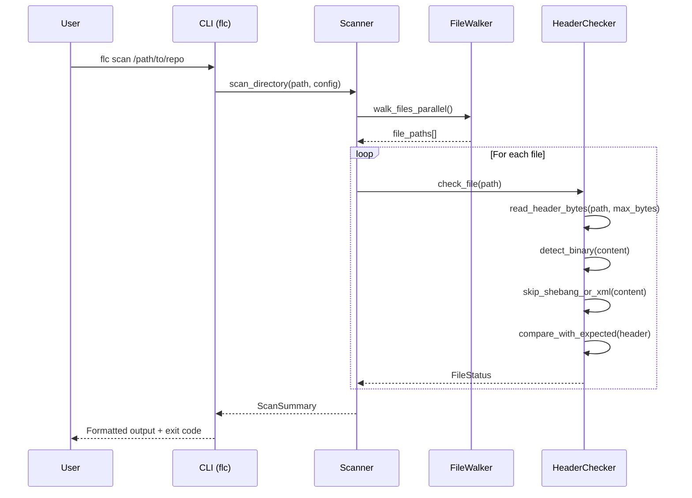
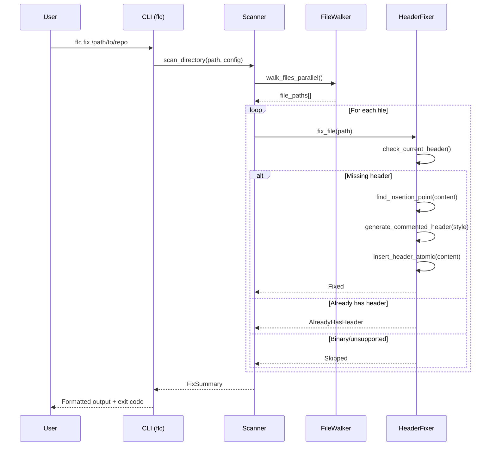
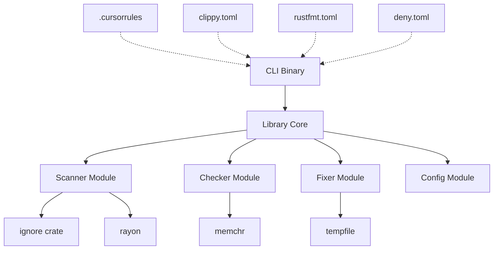

# RFC 0001: Fast License Checker

## Executive Summary

**Problem Statement:**
Manual license header verification doesn't scale. Existing tools are slow, poorly configured, or don't respect .gitignore.

**Proposed Solution:**
A blazing-fast CLI tool that:
- Scans directories respecting .gitignore
- Checks for license headers with fuzzy matching
- Auto-fixes missing headers (with shebang/XML awareness)
- Provides multiple output formats for CI integration

**Goals:**
- Scan 100,000 files in < 1 second (warm cache)
- Zero false positives on binary files
- Idempotent fix mode
- Exit code 0 = clean, 1 = issues found

**Non-Goals (v1):**
- License compatibility checking (GPL vs MIT)
- Fetching licenses from internet
- OCR/image scanning

## User Stories

### Happy Path: Clean Repository
As a maintainer, I want to run `flc .` and see "All 1,234 files have valid license headers" with exit code 0.

### Sad Path 1: Missing Headers
As a DevOps engineer, when files are missing headers, I want a clear list of paths and exit code 1 so CI blocks the PR.

### Sad Path 2: Shebang Files
As a maintainer, when I run fix mode on a shell script with `#!/bin/bash`, the license header should be inserted on line 2, preserving the shebang.

### Sad Path 3: Binary Files
As a user, when scanning a directory with images/binaries, those files should be automatically skipped without errors.

### Sad Path 4: Malformed Headers
As a compliance officer, when a file has a header that's 80% similar but not exact, I want a warning to manually review it.

### Sad Path 5: Large Files
As a user, when scanning a repo with large log files, the tool should only read the first N bytes and not hang.

## System Design

### Sequence Diagram - Scan Mode



### Sequence Diagram - Fix Mode



### Component Architecture



## Architectural Decision Records

| Decision | Context | Trade-offs |
|----------|---------|------------|
| Use `ignore` crate | Need .gitignore support, parallel walking | Adds dependency, but battle-tested in ripgrep |
| Use `rayon` over `tokio` | File scanning is CPU-bound, not IO-bound | Can't use async, but simpler mental model |
| Use byte slices `&[u8]` | Binary detection, performance | Must handle encoding explicitly |
| Use `thiserror` + `anyhow` | Typed errors in lib, friendly in CLI | Two error handling styles |
| Atomic writes via rename | Prevent corruption on crash | Requires temp file creation |
| Max 8KB header check | Don't read entire large files | Could miss headers placed later (rare) |

## Data Models (Skeleton)

```rust
// NewTypes
pub struct FilePath(PathBuf);
pub struct LicenseHeader(String);
pub struct CommentStyle { prefix: String, suffix: Option<String> }
pub struct FileExtension(String);
pub struct MaxHeaderBytes(usize);

// Enums
pub enum FileStatus {
    HasHeader,
    MissingHeader,
    MalformedHeader { similarity: u8 },
    Skipped { reason: SkipReason },
}

pub enum SkipReason {
    Binary,
    Empty,
    Gitignored,
    TooLarge,
    UnsupportedEncoding,
}

pub enum ScanMode {
    Check,
    Fix,
}

// Result types
pub struct ScanResult {
    pub path: FilePath,
    pub status: FileStatus,
}

pub struct FixResult {
    pub path: FilePath,
    pub action: FixAction,
}

pub enum FixAction {
    Fixed,
    AlreadyHasHeader,
    Skipped { reason: SkipReason },
    Failed { error: String },
}
```

## Implementation Phases

1. **Phase 1**: Bootstrap - project structure, configs, .cursorrules ✅
2. **Phase 2**: Design - RFC, design_sketch.rs that compiles
3. **Phase 3**: Core types - NewTypes, errors, config
4. **Phase 4**: Scanner - file walking with ignore crate
5. **Phase 5**: Checker - header detection with fuzzy matching
6. **Phase 6**: Fixer - header insertion with shebang awareness
7. **Phase 7**: CLI - clap interface, output formats
8. **Phase 8**: Testing - unit, integration, property-based
9. **Phase 9**: Benchmarks - criterion, 100k file target
10. **Phase 10**: CI/CD - GitHub Actions, release builds
